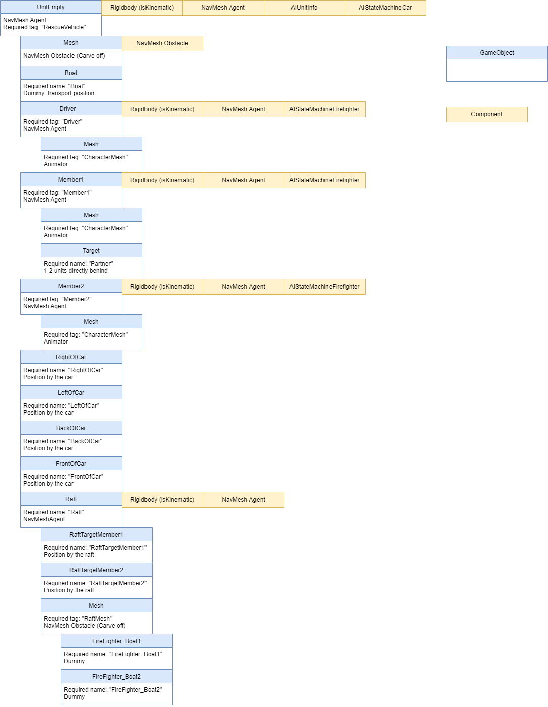
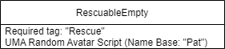

# Required when adding to the simulation

[README](../../README.md) / [Documentation](../Documentation.md)

---

## Adding global variables

All global AI and navigation related variables are added to the ScenarioVariables.cs file. These should be private and have a corresponding Property. All variables are initially set in the ScenarioVariables.Start() but can be read and set by other scripts (e.g. weather).

## Adding unit variables

Unit variables should be added to the AIUnitInfo.cs and follow the same principles than global variables.

## Firetruck structure

## Rescuable structure

