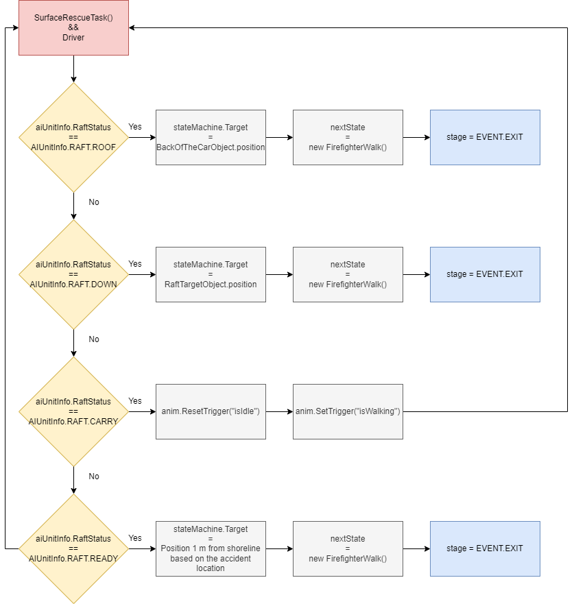
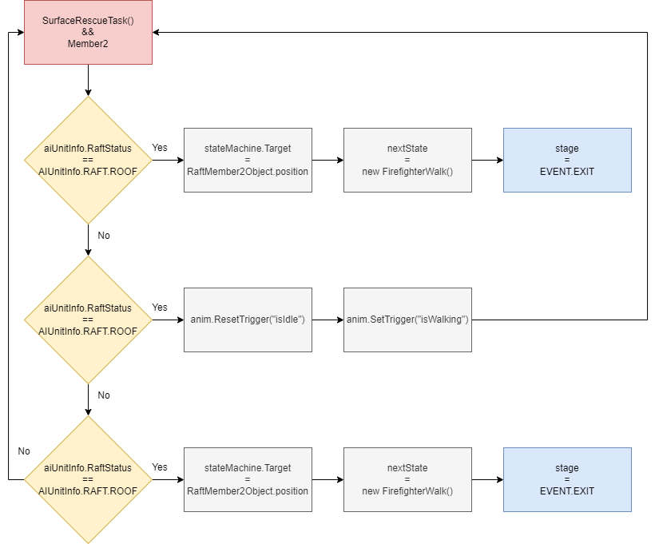

# FirefighterIdle

[README](../../../../../README.md) / [Documentation](../../../../Documentation.md) / [State Machine](../../../StateMachine.md) / [State](../../State.md) / [FirefighterState](FirefighterState.md)

---

## Table of Content

- [Fields](#fields)
- [Constructor](#constructor)
- [Methods](#methods)
- [Exit conditions](#exit-conditions)
- [Referenced by](#referenced-by)
- [Derived classes](#derived-classes)

---

FirefighterIdle is the base for all firefighter actions. One could imagine this state as a hub that sets up the following state chains and passes that information onwards to the FirefighterWalk state.

## Members

### Fields

| Field | Description |
| --- | --- |
| GameObject raft | Reference to AIUnitInfo.Raft |

### Constructor

_public FirefighterIdle(GameObject, NavMeshAgent, Animator)_
- Passes npc, agent and anim to the parent
- Sets name to STATE.IDLE

### Methods

_public override void Enter()_
- Logs AIUnitInfo.Leader, Unit name, NPC name and state
- Sets the correct animator for Member1 and Member2 based on if they are wearing the swimming suit
- Sets the animator trigger "isIdle"
- Sets the raft reference if the parent object has a raft
- Ends to calling base.Enter() to move on the next stage

_public override void Update()_
- Checks the NPC for AITaskDone component and calls TaskDone() if needed
- Checks for AIUnitInfo.TASK.SURFACE and AIUnitInfo.Target has value
    - If the NPC needs a swimming suit, calls GetSwimmingSuit()
    - If there's no need to get a swimming suit, calls SurfaceRescueTask()
- Checks for AIUnitInfo.TASK.SEARCH
    - If AIUnitInfo.SEARCHPATTERN.SHORELINE, not AIUnitInfo.SHORELINEDIRECTION.NULL and AIUnitInfo.Target has value
        - If the NPC needs a swimming suit, calls GetSwimmingSuit()
        - If there's no need to get a swimming suit, calls StartShorelineSearch()
    - If AIUnitInfo.SEARCHPATTERN.SECTOR, not AIUnitInfo.SECTORDIRECTION.NULL and AIUnitInfo.Target has value
        - If the NPC needs a swimming suit, calls GetSwimmingSuit()
        - If there's no need to get a swimming suit, calls StartSectorSearch()
- Checks for AIUnitInfo.TASK.FIRE and AIUnitInfo.Target has value
    - Calls Extinguish()
- Does **NOT** call base.Update() to avoid infinite loop

_public override void Exit()_
- Resets the animator trigger "isIdle"
- Ends to calling base.Exit() to move on the next state

_private void TaskDone()_
- Sets each crew member a target at the left front corner of their vehicle
- Exits to the FirefighterWalk state

_public void SurfaceRescueTask()_

_public void GetSwimmingSuit()_
- Sets stateMachine.Target to the LeftOfCarObject position
- Sets nextState to new FirefighterWalk()
- Sets stage to EVENT.EXIT

_public void GetDivingGear()_
- Sets stateMachine.Target to the DivingGearLication position
- Sets nextState to new FirefighterWalk()
- Sets stage to EVENT.EXIT

_public void StartShorelineSearch()_
- Checks if Member1 has diving gear on -> GetDivingGear() if not
- Finds a location 1 meter inland from the shoreline from the position of the accident place
- Sets each member a stateMachine.Target based on that inline position so that they form a line in direction of the inline position's normal vector towards water
- Sets nextState to new FirefighterWalk()
- Sets stage to EVENT.EXIT

_public void StartSectorSearch()_
- Checks if Member1 has diving gear on -> GetDivingGear() if not
- Checks that the given target location is in water -> return if not
- Driver gets stateMachine.Target set to 1 m inline from the shoreline from the position of the accident place
- SectorSearchAnchor gets position set by the earlier hit from the check if the target is in water
- Member1 gets a stateMachine.Target set by the SectorSearchAnchor
- Member2 gets a stateMachine.Target 1 m behind the Driver
- Each member has nextState set to new FirefighterWalk()
- Each member has stage set to EVENT.EXIT

_public void Extinguish()_
- Each member gets a stateMachine.Target from the back of the car, so that they form a line from the Driver being the closest
- Each member has nextState set to new FirefighterWalk()
- Each member has stage set to EVENT.EXIT

### Exit conditions

| Condition | Leads to |
| --- | --- |
| AITaskDone component | [FirefighterWalk](FirefighterWalk.md) |
| GivenTask == SURFACE | [FirefighterWalk](FirefighterWalk.md) |
| GivenTask == SURFACE && NeedsSwimmingSuit() | [FirefighterWalk](FirefighterWalk.md) |
| GivenTask == SEARCH && Pattern == SHORELINE | [FirefighterWalk](FirefighterWalk.md) |
| GivenTask == SEARCH && Pattern == SHORELINE && NeedsSwimmingSuit() | [FirefighterWalk](FirefighterWalk.md) |
| GivenTask == SEARCH && Pattern == SECTOR && NeedsSwimmingSuit() | [FirefighterWalk](FirefighterWalk.md) |
| GivenTask == SEARCH && Pattern == SECTOR && NeedsSwimmingSuit() && NeedsSwimmingSuit() | [FirefighterWalk](FirefighterWalk.md) |
| GivenTask == FIRE | [FirefighterWalk](FirefighterWalk.md) |

### Referenced by

- [AIStateMachineFirefighter](../../../AIStateMachineFirefighter.md)
- [FirefighterReturnHose](Extinguish/FirefighterReturnHose.md)
- [FirefighterWalk](FirefighterWalk.md)
- [FirefighterAssistRescue](SurfaceRescue/FirefighterAssistRescue.md)
- [FirefighterRescue](SurfaceRescue/FirefighterRescue.md)
- [FirefighterSectorSearch](SurfaceRescue/FirefighterSectorSearch.md)
- [FirefighterShorelinePhase1](SurfaceRescue/FirefighterShorelinePhase1.md)
- [FirefighterShorelinePhase2](SurfaceRescue/FirefighterShorelinePhase2.md)
- [FirefighterSwimmingSuit](SurfaceRescue/FirefighterSwimmingSuit.md)
- [FirefighterTakeDivingGear](SurfaceRescue/FirefighterTakeDivingGear.md)
- [FirefighterUsingRaft](SurfaceRescue/FirefighterUsingRaft.md)
