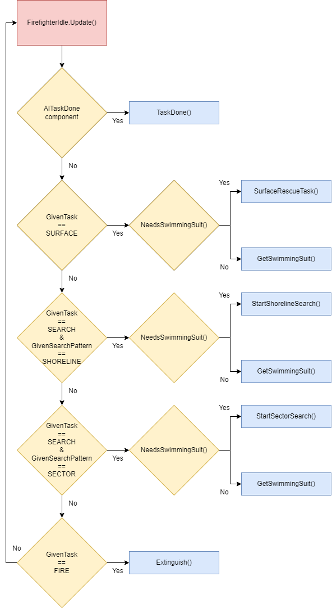
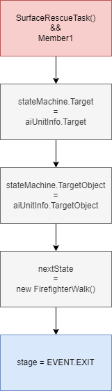

# FirefighterIdle

[README](../../../../../README.md) / [Documentation](../../../../Documentation.md) / [State Machine](../../../StateMachine.md) / [State](../../State.md) / [FirefighterState](FirefighterState.md)

---

## Table of Content

- [Fields](#fields)
- [Constructor](#constructor)
- [Methods](#methods)
- [Exit conditions](#exit-conditions)
- [Referenced by](#referenced-by)
- [Derived classes](#derived-classes)

---

FirefighterIdle is the base for all firefighter actions. One could imagine this state as a hub that sets up the following state chains and passes that information onwards to the FirefighterWalk state.

## Members

### Fields

| Field | Description |
| --- | --- |
| GameObject raft | Reference to AIUnitInfo.Raft |

### Constructor

_public FirefighterIdle(GameObject, NavMeshAgent, Animator)_
- Passes npc, agent and anim to the parent
- Sets name to STATE.IDLE

### Methods

_public override void Enter()_
- Logs AIUnitInfo.Leader, Unit name, NPC name and state
- Sets the correct animator for Member1 and Member2 based on if they are wearing the swimming suit
- Sets the animator trigger "isIdle"
- Sets the raft reference if the parent object has a raft
- Ends to calling base.Enter() to move on the next stage

_public override void Update()_
- Checks the NPC for AITaskDone component and calls TaskDone() if needed
- Checks for AIUnitInfo.TASK.SURFACE and AIUnitInfo.Target has value
    - If the NPC needs a swimming suit, calls GetSwimmingSuit()
    - If there's no need to get a swimming suit, calls SurfaceRescueTask()
- Checks for AIUnitInfo.TASK.SEARCH
    - If AIUnitInfo.SEARCHPATTERN.SHORELINE, not AIUnitInfo.SHORELINEDIRECTION.NULL and AIUnitInfo.Target has value
        - If the NPC needs a swimming suit, calls GetSwimmingSuit()
        - If there's no need to get a swimming suit, calls StartShorelineSearch()
    - If AIUnitInfo.SEARCHPATTERN.SECTOR, not AIUnitInfo.SECTORDIRECTION.NULL and AIUnitInfo.Target has value
        - If the NPC needs a swimming suit, calls GetSwimmingSuit()
        - If there's no need to get a swimming suit, calls StartSectorSearch()
- Checks for AIUnitInfo.TASK.FIRE and AIUnitInfo.Target has value
    - Calls Extinguish()
- Does **NOT** call base.Update() to avoid infinite loop

_public override void Exit()_
- Resets the animator trigger "isIdle"
- Ends to calling base.Exit() to move on the next state

_private void TaskDone()_
- Sets each crew member a target at the left front corner of their vehicle
- Exits to the FirefighterWalk state

_public void SurfaceRescueTask()_

_public void GetSwimmingSuit()_

_public void GetDivingGear()_

_public void StartShorelineSearch()_

_public void StartSectorSearch()_

_public void Extinguish()_

### Exit conditions

| Condition | Leads to | Sets |
| --- | --- | --- |
|  |  |  |

### Referenced by

- 

### Derived classes

| Class | Description |
| --- | --- |
|  |  |